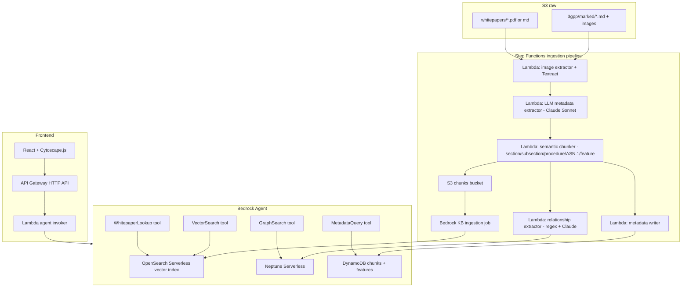

## Architecture



## Repo layout (new, greenfield)

- `infra/` - AWS CDK Python app (one app, multiple stacks)
  - `infra/app.py` - CDK entry
  - `infra/stacks/storage_stack.py` - S3 buckets, DynamoDB tables
  - `infra/stacks/knowledge_stack.py` - OpenSearch Serverless collection + Bedrock KB + data source
  - `infra/stacks/graph_stack.py` - Neptune Serverless cluster, VPC endpoints
  - `infra/stacks/pipeline_stack.py` - Step Functions, Lambdas, IAM
  - `infra/stacks/agent_stack.py` - Bedrock Agent, action groups, OpenAPI schemas
  - `infra/stacks/api_stack.py` - API Gateway + agent invoker Lambda
- `lambdas/` - Python 3.12 Lambdas (one folder per function with `handler.py`, `requirements.txt`)
  - `image_textract/` - finds image refs in markdown, calls Textract `AnalyzeDocument`, inlines extracted text
  - `metadata_extractor/` - Claude (Bedrock Converse API) extracts the structured JSON metadata schema you specified
  - `semantic_chunker/` - markdown AST walker splitting on section/subsection/procedure/ASN.1/feature
  - `relationship_extractor/` - regex for `TS NN.NNN`, `clause N.N.N`, reference lists, ASN.1 IMPORTS + Claude for semantic links (whitepaper -> spec feature)
  - `metadata_writer/` - writes chunk + feature rows to DynamoDB
  - `neptune_writer/` - writes nodes/edges via Neptune openCypher HTTP endpoint
  - `agent_tools/vector_search/` - calls Bedrock KB `Retrieve`
  - `agent_tools/graph_search/` - openCypher queries against Neptune
  - `agent_tools/metadata_query/` - DynamoDB queries by spec / release / feature
  - `agent_tools/whitepaper_lookup/` - KB `Retrieve` with `source_type = "whitepaper"` filter
  - `agent_invoker/` - API Gateway -> `InvokeAgent`
- `agent/schemas/` - OpenAPI 3 schemas for the 4 action groups (consumed by Bedrock Agent)
- `frontend/` - Vite + React + TypeScript + Cytoscape.js
  - `src/components/FeatureCloud.tsx` - main Cytoscape canvas
  - `src/components/DetailPanel.tsx` - side panel with chunk content + citations
  - `src/api/agent.ts` - calls API Gateway
- `scripts/` - one-off CLIs (uv-runnable): `ingest_local.py` for local dry-run, `seed_demo.py`

## Data model

### DynamoDB tables (single-table not needed; two tables for clarity)

- `chunks-table` - PK `chunk_id`, GSI1 `spec#release` -> `section`, attrs: full metadata JSON, S3 pointer, embedding_id
- `features-table` - PK `feature_id` (e.g. `38.331#5.5.4#measurement_reporting`), attrs: name, spec, section, keywords, related feature_ids

### OpenSearch Serverless (managed by Bedrock KB)

- Single vector index, 1024 dims (Titan Text Embeddings v2), cosine similarity
- Filterable metadata fields: `spec`, `release`, `section`, `feature`, `vendor`, `technology`, `source_type` ("3gpp" | "whitepaper"), `keywords[]`, `related_specs[]`

### Neptune graph schema (property graph)

- Nodes: `Spec`, `Release`, `Section`, `Feature`, `Whitepaper`, `Vendor`, `Procedure`, `ASN1Type`
- Edges: `DEFINED_IN`, `REFERENCES`, `IMPORTS`, `EXPLAINS` (whitepaper -> feature), `DEPLOYED_BY` (vendor -> feature), `RELATED_TO`, `SUPERSEDES` (release evolution)

## Pipeline details

### Semantic chunking strategy (`semantic_chunker`)

Walk the markdown AST (using `markdown-it-py`) and emit a chunk whenever we hit one of:

- Any `#`-level heading (section / subsection)
- A "Procedure" block (heuristic: heading text starts with `Procedure`, or contains `signalling flow`)
- An ASN.1 fenced code block (` ```asn1 ` or content matching `::= SEQUENCE`)
- A "Feature" definition block (heuristic on Rel-NN feature tables)

Each chunk gets a stable `chunk_id = sha1(spec|release|section|offset)` and the metadata schema you described. Chunks larger than 8 KB are sub-split at paragraph boundaries with 10 percent overlap. Chunks are written as `{chunk_id}.json` to the `chunks/` S3 prefix; Bedrock KB ingests this prefix with the "no chunking" strategy so our boundaries are preserved.

### Relationship extraction (`relationship_extractor`)

Hybrid as you chose:

- Regex pass: `TS\s\d{2}\.\d{3}`, `clause\s\d+(\.\d+)*`, `\[\d+\]` references list, ASN.1 `IMPORTS ... FROM` blocks. Emits `REFERENCES`, `IMPORTS`, `DEFINED_IN` edges directly.
- Claude pass (Bedrock Converse, batch): given a whitepaper chunk + top-5 vector-similar 3GPP chunks, produce `EXPLAINS` and `RELATED_TO` typed edges with a confidence score. Only edges with confidence >= 0.7 are written.

## Agent (Bedrock Agent)

Foundation model: `anthropic.claude-sonnet-4-5-20251001-v2:0` (or current Sonnet). Four action groups, each backed by one Lambda and one OpenAPI schema in `agent/schemas/`:

- `vector_search(query, top_k, filters)` -> KB `Retrieve` with metadata filters
- `graph_search(start_node, edge_types, depth)` -> openCypher template queries; returns nodes + edges JSON ready for Cytoscape
- `metadata_query(spec?, release?, section?, feature?, vendor?)` -> DynamoDB query/GSI; returns structured rows
- `whitepaper_lookup(spec_or_feature)` -> KB `Retrieve` filtered on `source_type = whitepaper`

The agent's system prompt instructs it to: (1) start with `vector_search` to find the most relevant chunks, (2) call `graph_search` to expand neighborhood for the visual cloud, (3) call `metadata_query` for exact attribute lookups, (4) call `whitepaper_lookup` for vendor / deployment context.

## Frontend "feature cloud"

- Search box -> POST `/ask` -> agent invocation; agent returns `{ summary, nodes, edges, citations }`
- Cytoscape renders nodes (specs, features, whitepapers color-coded) with `cose-bilkent` layout for the cloud feel
- Click a node -> calls `graph_search` again with `start_node = nodeId, depth = 1` to expand; new nodes/edges merged into the canvas
- Detail panel shows chunk markdown rendered, with `Source: TS 38.331 Rel-18 section 5.5.4` citations

## Security and Well-Architected notes

- S3 buckets: SSE-KMS with a dedicated CMK, BPA on, versioning enabled (see `securing-s3-buckets` skill)
- All Lambdas least-privilege; per-function IAM roles
- Neptune in private subnets; Lambdas access via VPC endpoints
- OpenSearch Serverless data access policy scoped to the KB role + agent tool roles only
- CloudWatch alarms on Step Functions failures, Bedrock throttling, agent invocation errors (see `aws-observability` skill)
- AWS resource names use hyphens only (per `AGENTS.md`)

## Out of scope (call out explicitly)

- Authn/authz on the frontend (add Cognito later)
- Multi-tenant isolation
- Cost guardrails beyond a basic Budget alarm
- Whitepaper PDF parsing beyond Textract; we assume whitepapers are already PDF or markdown
