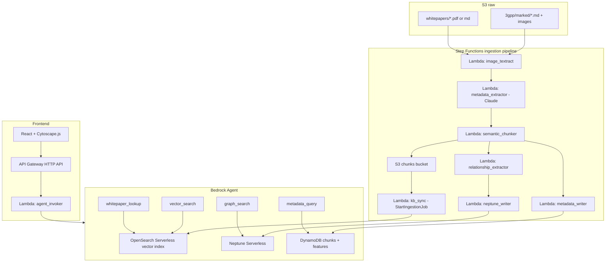

# team49 - 3GPP Knowledge Graph Agent

A serverless AWS solution that ingests 3GPP markdown specifications and vendor
whitepapers from S3, enriches them with Textract (images and tables) and
Claude (structured metadata), semantically chunks them, embeds them with
Titan Text Embeddings v2 into a Bedrock Knowledge Base, builds a Neptune
relationship graph, and exposes 4 Bedrock Agent tools (Vector, Graph,
Metadata, Whitepaper) consumed by a React and Cytoscape.js "feature cloud"
UI.

## Architecture



## Repo layout

```
team49/
├── agent/
│   └── schemas/                      # OpenAPI 3 schemas for the 4 Bedrock Agent action groups
│       ├── vector_search.openapi.json
│       ├── graph_search.openapi.json
│       ├── metadata_query.openapi.json
│       └── whitepaper_lookup.openapi.json
├── infra/                            # AWS CDK Python app (one app, 7 stacks)
│   ├── app.py
│   ├── cdk.json
│   ├── requirements.txt
│   └── stacks/
│       ├── storage_stack.py          # S3 raw + chunks buckets, DynamoDB chunks + features tables
│       ├── knowledge_stack.py        # OpenSearch Serverless + Bedrock Knowledge Base + data source
│       ├── graph_stack.py            # Neptune Serverless cluster in a private VPC
│       ├── pipeline_stack.py         # Step Functions + ingestion Lambdas + EventBridge S3 trigger
│       ├── agent_stack.py            # Bedrock Agent, action groups, tool Lambdas
│       ├── api_stack.py              # API Gateway HTTP API + agent_invoker Lambda
│       └── observability_stack.py    # CloudWatch alarms + central dashboard
├── lambdas/                          # Python 3.12 Lambda handlers
│   ├── image_textract/handler.py
│   ├── metadata_extractor/handler.py
│   ├── semantic_chunker/handler.py
│   ├── relationship_extractor/handler.py
│   ├── metadata_writer/handler.py
│   ├── neptune_writer/handler.py
│   ├── kb_sync/handler.py
│   ├── agent_invoker/handler.py
│   └── agent_tools/
│       ├── vector_search/handler.py
│       ├── graph_search/handler.py
│       ├── metadata_query/handler.py
│       └── whitepaper_lookup/handler.py
├── frontend/                         # Vite + React + TypeScript + Cytoscape.js
│   ├── index.html
│   ├── package.json
│   ├── tsconfig.json
│   ├── vite.config.ts
│   └── src/
│       ├── App.tsx
│       ├── main.tsx
│       ├── styles.css
│       ├── api/agent.ts
│       └── components/
│           ├── FeatureCloud.tsx
│           └── DetailPanel.tsx
├── scripts/
│   └── seed_demo.py                  # Uploads a small sample corpus and verifies POST /ask
└── AGENTS.md
```

## Data model

### DynamoDB

- `chunks-table` - PK `chunk_id`, GSI1 on `spec#release` to `section`,
  attributes include full metadata JSON, S3 pointer, embedding_id.
- `features-table` - PK `feature_id` (e.g. `38.331#5.5.4#measurement_reporting`),
  attributes include name, spec, section, keywords, related feature_ids.

### OpenSearch Serverless (managed by Bedrock Knowledge Base)

- Single vector index, 1024 dimensions (Titan Text Embeddings v2), cosine
  similarity, "no chunking" ingestion strategy (chunk boundaries are
  decided by `semantic_chunker`).
- Filterable metadata fields: `spec`, `release`, `section`, `feature`,
  `vendor`, `technology`, `source_type` (`3gpp` | `whitepaper`),
  `keywords[]`, `related_specs[]`.

### Neptune property graph

- Nodes: `Spec`, `Release`, `Section`, `Feature`, `Whitepaper`, `Vendor`,
  `Procedure`, `ASN1Type`.
- Edges: `DEFINED_IN`, `REFERENCES`, `IMPORTS`, `EXPLAINS`
  (whitepaper to feature), `DEPLOYED_BY` (vendor to feature),
  `RELATED_TO`, `SUPERSEDES` (release evolution).

## Pipeline

S3 uploads to the raw bucket trigger an EventBridge rule that starts the
Step Functions Standard workflow. The workflow runs Textract image
extraction, Claude-based metadata extraction, semantic chunking,
relationship extraction (regex + Claude), and writes results to the
chunks S3 bucket, DynamoDB, and Neptune. On success it calls Bedrock
`StartIngestionJob` to sync the Knowledge Base.

### Semantic chunking

`semantic_chunker` walks markdown structure and emits a chunk on each
`#`-level heading, "Procedure" block, ASN.1 fenced block, or Rel-NN
feature table. Each chunk gets a stable
`chunk_id = sha1(spec|release|section|offset)`; chunks larger than 8 KB are
sub-split at paragraph boundaries with 10 percent overlap.

### Relationship extraction

`relationship_extractor` runs a hybrid pass:

- Regex for `TS NN.NNN`, `clause N.N.N`, references lists, ASN.1
  `IMPORTS ... FROM`. Emits `REFERENCES`, `IMPORTS`, `DEFINED_IN` directly.
- Claude (Bedrock Converse) over whitepaper chunks to produce `EXPLAINS`
  and `RELATED_TO` edges with a confidence score. Only edges with
  confidence >= 0.7 are written.

## Bedrock Agent

Foundation model: configured via CDK context (`foundation_model`,
defaults to Claude 3.5 Sonnet; override to current Sonnet if available).

Four action groups, each backed by one Lambda and one OpenAPI schema in
`agent/schemas/`:

- `vector_search(query, top_k, filters)` - KB `Retrieve` with metadata filters.
- `graph_search(start_node, edge_types, depth)` - openCypher template queries
  against Neptune; returns nodes and edges JSON ready for Cytoscape.
- `metadata_query(spec?, release?, section?, feature?, vendor?)` - DynamoDB
  query / GSI; returns structured rows.
- `whitepaper_lookup(spec_or_feature)` - KB `Retrieve` filtered on
  `source_type = whitepaper`.

The agent system prompt instructs it to: (1) start with `vector_search` to
find the most relevant chunks, (2) call `graph_search` to expand the
neighborhood for the visual cloud, (3) call `metadata_query` for exact
attribute lookups, and (4) call `whitepaper_lookup` for vendor / deployment
context.

## Frontend "feature cloud"

- Search box submits to `POST /ask` on API Gateway. The agent returns
  `{ summary, nodes, edges, citations }`.
- Cytoscape.js renders nodes (specs, features, whitepapers color-coded)
  with a `cose-bilkent` style layout.
- Clicking a node calls `graph_search` again with `start_node = nodeId`,
  `depth = 1` and merges new nodes / edges into the canvas.
- The detail panel renders the chunk markdown with citations such as
  `Source: TS 38.331 Rel-18 section 5.5.4`.

## Prerequisites

- AWS account with Bedrock model access enabled for Claude Sonnet and
  Titan Text Embeddings v2 in your chosen region (default `us-east-1`).
- AWS CLI configured with credentials and a default region.
- Python 3.12 and [`uv`](https://docs.astral.sh/uv/) installed (used for
  the CDK app and the `scripts/` helpers).
- Node.js 20+ and npm for the frontend.
- AWS CDK v2 (`npm i -g aws-cdk`) and a one-time `cdk bootstrap` against
  your target account / region.

## Deploy

```bash
cd infra
uv venv && source .venv/bin/activate   # Windows: .venv\Scripts\activate
uv pip install -r requirements.txt

cdk bootstrap                          # first time only, per account/region
cdk deploy --all --require-approval never
```

Stacks are deployed in dependency order:

1. `Team49StorageStack`
2. `Team49KnowledgeStack`
3. `Team49GraphStack`
4. `Team49PipelineStack`
5. `Team49AgentStack`
6. `Team49ApiStack`
7. `Team49ObservabilityStack`

Note the `RawBucketName` and `HttpApiUrl` outputs - you will pass them to
`seed_demo.py` and the frontend respectively.

## Seed the demo corpus

```bash
uv run scripts/seed_demo.py \
  --raw-bucket <RawBucketName> \
  --api-url   <HttpApiUrl>
```

This uploads a small 3GPP markdown sample and a vendor whitepaper sample
to the raw bucket. EventBridge starts the ingestion pipeline within a few
seconds. With `--api-url` provided, the script also sends a sample
question to `POST /ask` once ingestion has had time to run and prints the
agent response.

## Run the frontend locally

```bash
cd frontend
npm install
VITE_API_URL=<HttpApiUrl> npm run dev
```

Open the printed URL (defaults to <http://localhost:5173>). For a
production build:

```bash
npm run build
npm run preview
```

## Observability

`Team49ObservabilityStack` provisions:

- CloudWatch alarms on Step Functions failures/timeouts, API Gateway 5xx,
  and Lambda error rates.
- A central dashboard summarising pipeline failures, Lambda errors, and API
  5xx responses.

Logs Insights queries and the dashboard make it straightforward to
correlate a failing ingestion run with the originating S3 object.

## Security and Well-Architected notes

- S3 buckets are SSE-KMS encrypted with a dedicated CMK, Block Public
  Access on, and versioning enabled.
- Per-function least-privilege IAM roles for every Lambda.
- Neptune lives in private subnets; ingestion and tool Lambdas reach it
  via VPC interface endpoints.
- OpenSearch Serverless data access policy is scoped to the Knowledge
  Base ingestion role and the agent tool roles only.
- All AWS resource names and descriptions use hyphens, not em dashes
  (see `AGENTS.md`).

## Out of scope

- Authn / authz on the frontend (Cognito can be added in front of
  API Gateway later).
- Multi-tenant isolation.
- Cost guardrails beyond a basic AWS Budgets alarm.
- Whitepaper PDF parsing beyond Textract; PDF or markdown whitepapers
  are assumed.

## Useful commands

| Task                                    | Command                                            |
| --------------------------------------- | -------------------------------------------------- |
| Synth CloudFormation                    | `cd infra && cdk synth`                            |
| Diff a stack                            | `cdk diff Team49PipelineStack`                     |
| Tail Step Functions executions          | `aws stepfunctions list-executions ...`            |
| Re-trigger KB ingestion                 | `aws bedrock-agent start-ingestion-job ...`        |
| Query Neptune via openCypher            | `curl https://<neptune-endpoint>:8182/openCypher`  |
| Send a question without the UI         | `curl -X POST <HttpApiUrl>/ask -d '{"query":"..."}'`|
